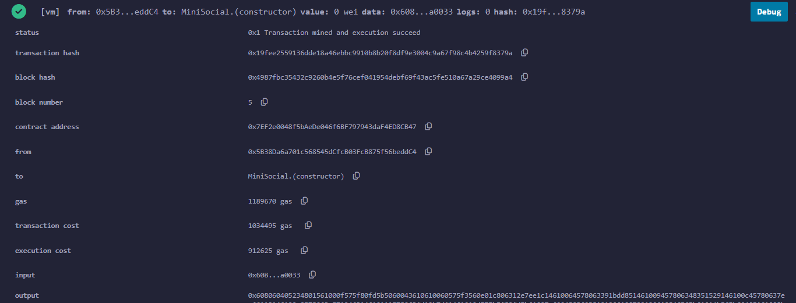
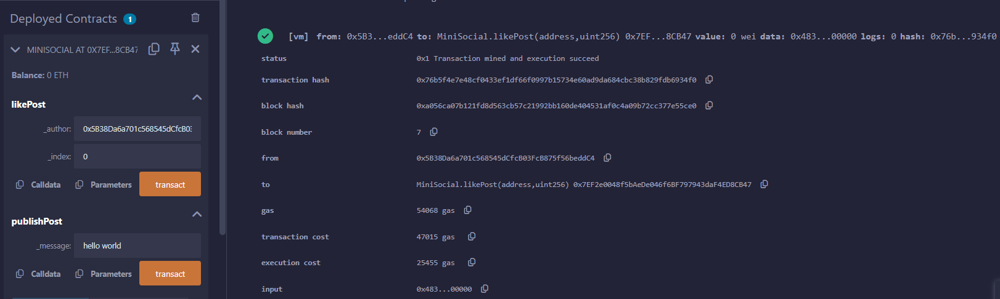

---

# MiniSocial Smart Contract

This is a Solidity-based smart contract called **MiniSocial**. It is a simple social network where users can publish posts, retrieve posts, and like each other's posts. The contract keeps track of each user's posts and allows them to interact through a decentralized platform.

## Table of Contents

- [Overview](#overview)
- [Features](#features)
- [Installation](#installation)
- [Usage](#usage)
- [Demonstraion](#demonstraion)

## Overview

The **MiniSocial** smart contract allows users to publish short messages, or "tweets," with a maximum length of 300 characters. Users can retrieve their own posts, view posts from other users, and like posts as a way of interaction. The contract is designed to work on the Ethereum blockchain or any compatible test network.

## Features

- Publish posts with a 300-character limit.
- Retrieve individual posts or all posts by a specific user.
- Like posts to show support.
- Retrieve the total number of posts by each user.

## Installation

To get started, you need to set up an Ethereum development environment. Follow these steps:

1. **Install Remix**:
   - Go to [Remix](https://remix.ethereum.org/) to access an online Solidity IDE.
   
2. **Set Up the Environment**:
   - Open the **Remix IDE** and create a new file called `MiniSocial.sol`.
   
3. **Copy the Contract Code**:
   - Copy the `MiniSocial` smart contract code into `MiniSocial.sol`.

4. **Compile the Contract**:
   - In the **Solidity Compiler** tab in Remix, select the correct compiler version (0.8.2 or above) and compile the contract.

5. **Deploy the Contract**:
   - Go to the **Deploy & Run Transactions** tab in Remix, select your environment (e.g., JavaScript VM, Injected Web3, etc.), and deploy the contract.

## Usage

Once the contract is deployed, you can interact with it using the following functions:

### 1. Publish a Post

- To publish a new post, use the `publishPost` function.
- Enter a message (up to 300 characters) and click **transact** to publish it.
- A new post will be created and stored under the sender’s address.

### 2. Get a Post

- To retrieve a specific post, use the `getPost` function.
- Enter the author’s address and the index of the post you want to retrieve.
- This will return the content of the post and the author’s address.

### 3. Get All Posts by a User

- To retrieve all posts from a specific user, use the `getAllTweets` function.
- Enter the author’s address, and this will return an array containing all posts made by the user.

### 4. Like a Post

- To like a post, use the `likePost` function.
- Enter the author's address and the post index (e.g., 0 for the first post) to like it.
- The `likes` count for the post will increment by 1.

### 5. Get Total Posts by a User

- To get the number of posts made by a user, use the `getTotalPosts` function.
- Enter the author’s address, and it will return the total count of posts by that user.

## demonstraion

### 1. Posting a Post

### 2. Liking a Post

---

