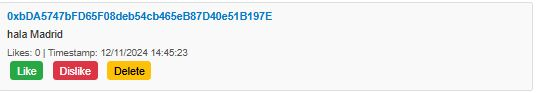
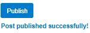

---

# Mini Social Network DApp

A decentralized social networking platform where users can publish posts, view posts from others, like, dislike, and delete posts. Built with Solidity for the smart contract and Web3.js for the front-end, this application interacts with the Ethereum blockchain to store and retrieve posts securely.

---

## Features

- **Publish a Post**: Write and publish a post directly on the blockchain.
- **View Posts**: View posts published by any user by providing their Ethereum address.
- **Like a Post**: Show appreciation by liking posts.
- **Dislike a Post**: Reduce the like count of a post (dislike functionality).
- **Delete a Post**: Authors can delete their own posts.

---

## Tech Stack

- **Front-end**: HTML, CSS, JavaScript, Web3.js
- **Smart Contract**: Solidity
- **Blockchain**: Ethereum (Testnet or Mainnet)
- **Wallet Integration**: MetaMask

---

## Prerequisites

- **Node.js** (to install dependencies)
- **MetaMask** browser extension
- Access to an Ethereum Testnet (like Goerli, Sepolia) or a local blockchain (like Ganache)

---

## Setup Instructions

### 1. Clone the Repository

```bash
git clone https://github.com/your-username/mini-social-network-dapp.git
cd mini-social-network-dapp
```

### 2. Install Dependencies

This project uses Web3.js from a CDN, so no local dependencies are required for the front-end. However, ensure you have Node.js installed for blockchain interaction testing if needed.

### 3. Deploy the Smart Contract

1. Open the `MiniSocial.sol` contract in your preferred Solidity IDE (e.g., Remix).
2. Compile the contract.
3. Deploy it to your preferred Ethereum test network.
4. Copy the deployed contract's address and replace the `CONTRACT_ADDRESS` in the `index.html` file.
5. Copy the contract ABI and replace the `CONTRACT_ABI` in the `index.html` file.

### 4. Configure MetaMask

- Add the same network (Testnet/Mainnet) where the contract is deployed.
- Ensure your MetaMask account has some test ETH for transactions.

### 5. Run the Application

Open `index.html` in a browser. Ensure MetaMask is connected and the correct network is selected.

---

## Smart Contract Functions

### Public Functions

1. **`publishPost(string _message)`**
   - Publishes a new post.
   - Emits an event upon success.

2. **`getAllTweets(address _author)`**
   - Fetches all posts published by the specified address.

3. **`likePost(address _author, uint256 _index)`**
   - Increments the like count of the post.

4. **`dislikePost(address _author, uint256 _index)`**
   - Decrements the like count of the post.

5. **`deletePost(uint256 _index)`**
   - Deletes the post at the specified index. Only the post author can perform this action.

### View Functions

1. **`getTotalPosts(address _author)`**
   - Returns the total number of posts by the specified author.

2. **`getPost(address _author, uint256 _index)`**
   - Retrieves a single post by its index for a specific author.

---

## Front-End Features

### Buttons and Functions

1. **Publish Post**: 
   - Textarea to write posts.
   - Button to submit and store the post on the blockchain.

2. **View Posts**:
   - Input field to specify an author's address.
   - Fetches and displays all posts by the given address.

3. **Like Post**:
   - Button to like a post.

4. **Dislike Post**:
   - Button to dislike a post.

5. **Delete Post**:
   - Button for the post author to delete the post.

---

## Screenshots

### Home Page


### Viewing Posts


### Publishing Posts


---

## Future Enhancements

- Add comments functionality.
- Enable searching for posts by keywords.
- Integrate IPFS for decentralized media storage (e.g., images, videos).
- Implement user profiles with a profile picture and bio.
- Use The Graph for faster and more efficient data querying.

---

## License

This project is licensed under the MIT License. See the [LICENSE](LICENSE) file for details.

---

## Contributing

Contributions are welcome! Please fork the repository, make changes, and submit a pull request. For significant changes, open an issue first to discuss your proposal.


---
